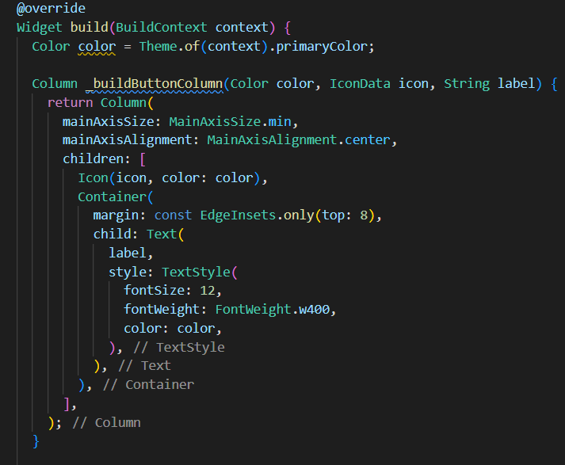

## FARHAN RAMAZAIN 
## TI - 3G
## 2141720209
## Pertemuan 7 Layout dan Navigasi

## Praktikum 1: Membangun Layout di Flutter

# Langkah 1 : Buat Projek Baru
# Langkah 2: Buka file lib/main.dart
# Buka file main.dart lalu ganti dengan kode berikut. Isi nama dan NIM Anda di text title

# Output

# Langkah 3: Identifikasi layout diagram
Langkah pertama adalah memecah tata letak menjadi elemen dasarnya:

- Identifikasi baris dan kolom.
- Apakah tata letaknya menyertakan kisi-kisi (grid)?
- Apakah ada elemen yang tumpang tindih?
- Apakah UI memerlukan tab?
- Perhatikan area yang memerlukan alignment, padding, atau borders.

Elemen menjadi satu kolom terdiri dari gambar, dua baris, dan satu blok teks.

Baris pertama, disebut  "Judul", terdiri dari tiga komponen: kolom teks, ikon bintang, dan sebuah angka. Terdapat dua baris teks. Kolom pertama ini mengambil banyak ruang, sehingga perlu ditempatkan dalam sebuah widget yang dapat diperluas.

Baris kedua, disebut bagian Tombol, juga memiliki 3 anak: setiap anak merupakan kolom yang berisi ikon dan teks.

# Langkah 4: Implementasi title row

# Output

## Praktikum 2: Implementasi button row

# Langkah 1: Buat method Column _buildButtonColumn
buildButtonColumn(Color color, IconData icon, String label): digunakan untuk membuat widget yang berisi kolom (Column) dengan ikon dan teks. Metode ini menerima tiga parameter: warna latar belakang kolom (Color), ikon yang akan ditampilkan (IconData), dan teks yang akan ditampilkan (String).

# Langkah 2: Buat widget buttonSection
keseluruhan kode ini digunakan untuk membuat baris (Row) yang berisi tiga tombol dengan berbagai ikon dan teks yang berbeda. 

# Langkah 3: Tambah button section ke body

## Praktikum 3: Implementasi text section

# Langkah 1: Buat widget textSection
kode ini  digunakan untuk membuat widget textSection yang berisi sebuah Container dengan teks di dalamnya. Namun, kode yang Anda berikan tidak lengkap, dan perlu ditambahkan teks yang sebenarnya yang ingin Anda tampilkan dalam Text widget tersebut.

# Langkah 2: Tambahkan variabel text section ke body

## Praktikum 4: Implementasi image section

# Langkah 1: Siapkan aset gambar

# Langkah 2: Tambahkan gambar ke body

# Langkah 3: Terakhir, ubah menjadi ListView

# Output
